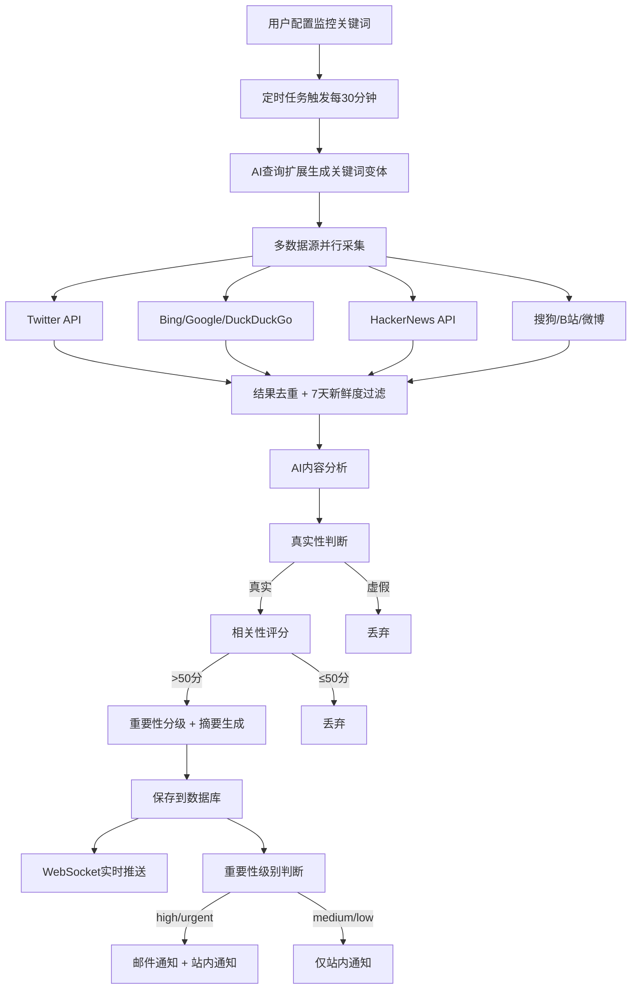
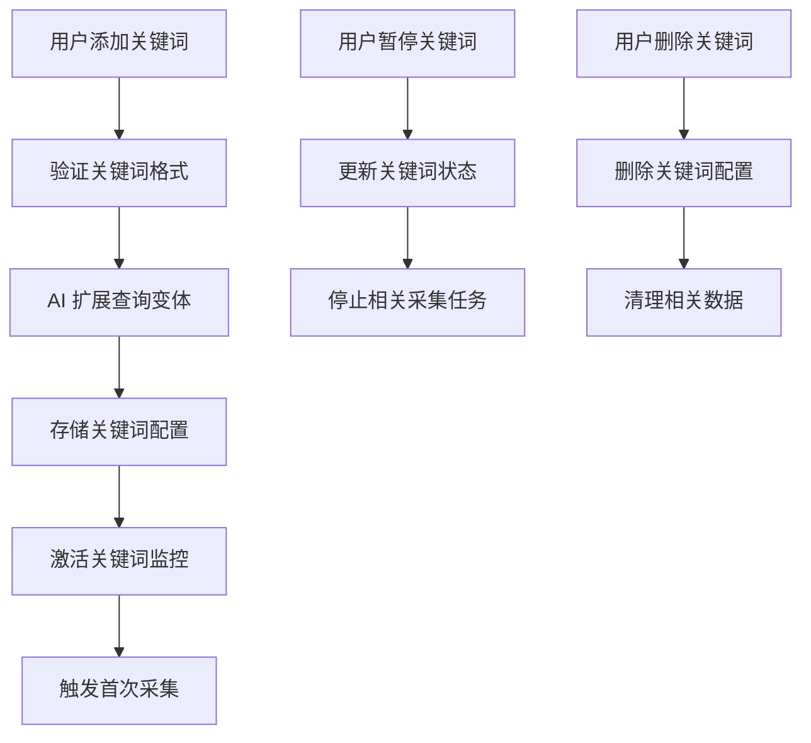
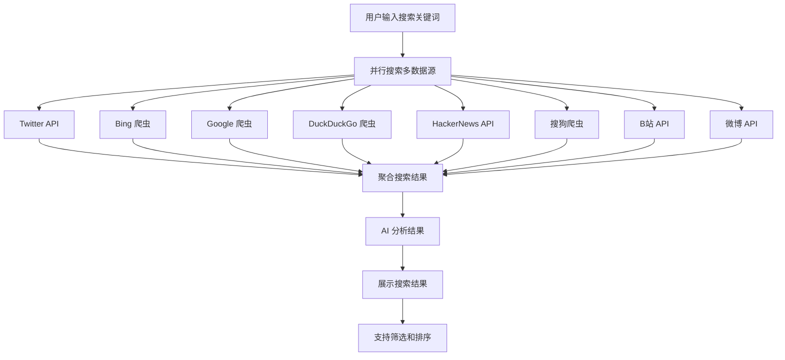
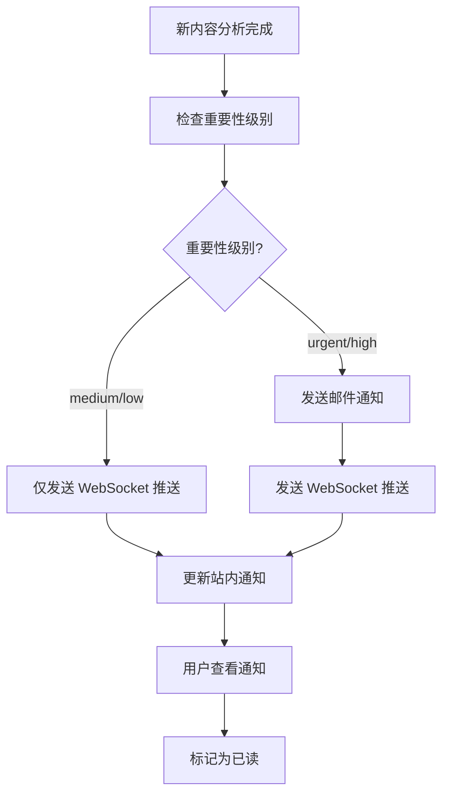

# AI 热点监控工具 - 技术架构详细设计文档

## 1. 文档概述

### 1.1 文档目的
本文档详细描述 AI 热点监控工具的技术架构设计，包括系统架构、模块划分、技术选型、核心流程等，为开发团队提供技术实现指导。

### 1.2 术语定义
| 术语 | 解释 |
|------|------|
| Query Expansion | AI 驱动的查询扩展，自动生成关键词变体 |
| OpenRouter | 统一 AI 模型接入服务 |
| Prisma | 类型安全的数据库 ORM |
| Socket.io | WebSocket 实时通信库 |
| Tailwind CSS | 原子化 CSS 框架 |
| Aceternity UI | 科技感视觉动效组件库 |

## 2. 系统架构

### 2.1 整体架构

```
┌─────────────────────────────────────────────────────────────────┐
│                          客户端层                                 │
│  ┌───────────────┐  ┌────────────────┐  ┌───────────────────────┐  │
│  │ React 19 前端  │  │ Socket.io-client │  │ Tailwind CSS + Aceternity UI │  │
│  └───────────────┘  └────────────────┘  └───────────────────────┘  │
└─────────────────────────────────────────────────────────────────┘
                              │
                              │
┌─────────────────────────────────────────────────────────────────┐
│                          应用层                                   │
│  ┌────────────────────┐  ┌────────────────┐  ┌────────────────┐  │
│  │ Express 5 + TypeScript │  │ RESTful API 路由 │  │ Socket.io 推送  │  │
│  └────────────────────┘  └────────────────┘  └────────────────┘  │
│  ┌────────────────┐  ┌────────────────┐                          │
│  │ node-cron 定时任务 │  │ Prisma ORM     │                          │
│  └────────────────┘  └────────────────┘                          │
└─────────────────────────────────────────────────────────────────┘
                              │
                              │
┌─────────────────────────────────────────────────────────────────┐
│                          业务层                                   │
│  ┌──────────────────────────────────┐  ┌──────────────────────────┐  │
│  │        多数据源采集                │  │        AI 分析服务         │  │
│  │  ┌──────────┐  ┌──────────┐      │  │  ┌───────────────┐        │  │
│  │  │Twitter API│  │Bing 爬虫  │      │  │  │Query Expansion│        │  │
│  │  └──────────┘  └──────────┘      │  │  └───────────────┘        │  │
│  │  ┌──────────┐  ┌──────────┐      │  │  ┌──────────┐  ┌──────────┐  │  │
│  │  │Google 爬虫│  │DuckDuckGo│      │  │  │真实性判断│  │相关性评分│  │  │
│  │  └──────────┘  └──────────┘      │  │  └──────────┘  └──────────┘  │  │
│  │  ┌──────────┐  ┌──────────┐      │  │  ┌──────────┐  ┌──────────┐  │  │
│  │  │HackerNews│  │搜狗爬虫  │      │  │  │重要性分级│  │智能摘要  │  │  │
│  │  └──────────┘  └──────────┘      │  │  └──────────┘  └──────────┘  │  │
│  │  ┌──────────┐  ┌──────────┐      │  └──────────────────────────┘  │  │
│  │  │B站 API  │  │微博 API  │      │                                │  │
│  │  └──────────┘  └──────────┘      │                                │  │
│  └──────────────────────────────────┘                                │  │
│  ┌──────────────────────────────────┐  ┌──────────────────────────┐  │  │
│  │        通知服务                   │  │        Agent Skills       │  │  │
│  │  ┌──────────┐  ┌──────────┐      │  │  ┌──────────┐  ┌──────────┐  │  │
│  │  │WebSocket推送│  │邮件通知  │      │  │  │SKILL.md  │  │Python脚本 │  │  │
│  │  └──────────┘  └──────────┘      │  │  └──────────┘  └──────────┘  │  │
│  │  ┌──────────┐                    │  │  ┌──────────┐              │  │  │
│  │  │分级通知策略│                    │  │  │分析框架  │              │  │  │
│  │  └──────────┘                    │  │  └──────────┘              │  │  │
│  └──────────────────────────────────┘  └──────────────────────────┘  │  │
│  ┌──────────────────────────────────┐                                │  │
│  │        信息展示服务                 │                                │  │
│  │  ┌──────────┐  ┌──────────┐      │                                │  │
│  │  │多维度排序│  │多维度筛选│      │                                │  │
│  │  └──────────┘  └──────────┘      │                                │  │
│  │  ┌──────────┐  ┌──────────┐      │                                │  │
│  │  │分页查询  │  │全网搜索  │      │                                │  │
│  │  └──────────┘  └──────────┘      │                                │  │
│  └──────────────────────────────────┘                                │  │
└─────────────────────────────────────────────────────────────────┘
                              │
                              │
┌─────────────────────────────────────────────────────────────────┐
│                          外部服务层                                │
│  ┌────────────────┐  ┌────────────────┐  ┌──────────┐  ┌──────────┐  │
│  │ OpenRouter API │  │ TwitterAPI.io  │  │搜索引擎  │  │SMTP 邮件 │  │
│  └────────────────┘  └────────────────┘  └──────────┘  └──────────┘  │
└─────────────────────────────────────────────────────────────────┘
                              │
                              │
┌─────────────────────────────────────────────────────────────────┐
│                          存储层                                   │
│                         SQLite + Prisma                           │
└─────────────────────────────────────────────────────────────────┘
```

### 2.2 架构特点

1. **分层架构**：清晰的分层设计，便于代码维护和功能扩展
2. **模块化**：各功能模块独立，可单独开发和测试
3. **实时性**：WebSocket 实时推送，确保热点信息及时送达
4. **可扩展性**：支持新增信息源和 AI 模型
5. **安全性**：包含完整的安全措施，防止恶意攻击

## 3. 模块划分与职责

### 3.1 客户端层

| 模块 | 技术 | 职责 |
|------|------|------|
| React 19 前端 | React 19 + TypeScript | 提供用户界面，处理用户交互 |
| Socket.io-client | Socket.io-client | 与服务端建立 WebSocket 连接，接收实时推送 |
| UI 框架 | Tailwind CSS + Aceternity UI | 提供美观的用户界面和交互体验 |
| 动画库 | Framer Motion | 提供流畅的动画效果 |
| 图标库 | Lucide React | 提供统一的图标系统 |

### 3.2 应用层

| 模块 | 技术 | 职责 |
|------|------|------|
| Express 5 服务 | Express 5 + TypeScript | 提供 HTTP 服务，处理 API 请求 |
| RESTful API 路由 | Express Router | 定义和处理 RESTful API 接口 |
| Socket.io 推送 | Socket.io | 处理 WebSocket 连接和实时推送 |
| 定时任务 | node-cron | 调度定时采集任务 |
| 数据库 ORM | Prisma ORM | 提供类型安全的数据库访问 |

### 3.3 业务层

| 模块 | 职责 | 关键功能 |
|------|------|----------|
| 多数据源采集 | 从各信息源抓取内容 | 8+ 数据源并行采集、自动抓取频率控制 |
| AI 分析服务 | 对内容进行 AI 分析 | 真实性判断、相关性评分、重要性分级、智能摘要 |
| 通知服务 | 向用户发送通知 | WebSocket 实时推送、邮件通知、分级通知策略 |
| 信息展示服务 | 展示和筛选热点信息 | 多维度排序、多维度筛选、分页加载 |
| 全网搜索 | 全网关键词搜索 | 多数据源聚合搜索、搜索结果筛选排序 |
| Agent Skills | 封装为 AI 技能 | 完全自包含、多工具支持、无需后端服务 |

### 3.4 外部服务层

| 服务 | 用途 |
|------|------|
| OpenRouter API | 统一接入 AI 大模型 |
| TwitterAPI.io | Twitter 高级搜索 |
| 搜索引擎 | 网页搜索 (Bing/Google/DuckDuckGo/搜狗) |
| SMTP 邮件 | 发送邮件通知 |

### 3.5 存储层

| 存储 | 用途 |
|------|------|
| SQLite | 轻量级嵌入式数据库 |
| Prisma | 数据库 ORM，提供类型安全的数据库访问 |

## 4. 技术选型详细说明

### 4.1 后端技术

| 技术 | 版本 | 选型理由 |
|------|------|----------|
| Express 5 | 5.0+ | 轻量级、高性能的 Node.js Web 框架，原生支持 async/await，适合构建 RESTful API |
| TypeScript | 5.0+ | 提供类型安全，减少运行时错误，提高代码可维护性 |
| Prisma ORM | 5.0+ | 类型安全的数据库 ORM，自动生成类型定义，支持 SQLite |
| Socket.io | 4.0+ | 可靠的 WebSocket 库，支持实时通信，自动降级机制 |
| node-cron | 3.0+ | 轻量级定时任务调度库，适合设置定期采集任务 |
| Nodemailer | 6.0+ | 功能强大的邮件发送库，支持多种邮件服务 |
| Axios | 1.0+ | 基于 Promise 的 HTTP 客户端，适合 HTTP 请求和爬虫 |
| Cheerio | 1.0+ | 轻量级 HTML 解析库，适合网页爬虫 |

### 4.2 前端技术

| 技术 | 版本 | 选型理由 |
|------|------|----------|
| React 19 | 19.0+ | 最新版本的 React，支持 Server Components 等新特性 |
| Vite 7 | 7.0+ | 新一代前端构建工具，开发体验好，构建速度快 |
| Tailwind CSS 4 | 4.0+ | 原子化 CSS 框架，开发效率高，样式一致 |
| Framer Motion | 11.0+ | 流畅的 React 动画库，提供丰富的动画效果 |
| Aceternity UI | 最新版 | 科技感视觉动效组件，提升用户体验 |
| Socket.io-client | 4.0+ | WebSocket 客户端，与服务端实时通信 |
| Lucide React | 0.300+ | 现代图标库，提供丰富的图标选择 |

### 4.3 AI 技术

| 技术 | 用途 | 选型理由 |
|------|------|----------|
| OpenRouter API | 统一 AI 模型接入 | 支持多种 AI 模型，简化 API 调用 |
| Query Expansion | AI 驱动的查询扩展 | 提高搜索覆盖范围，增强监控效果 |

### 4.4 AI 编程工具

| 技术 | 用途 | 选型理由 |
|------|------|----------|
| MCP 插件 | 增强 AI 编程能力 | Firecrawl(网页抓取)、Context7(最新技术文档) |
| Agent Skills | 封装为 AI 技能 | UI UX Pro Max(前端美化)、Skill Creator(技能开发) |

### 4.5 数据采集技术

| 技术 | 用途 | 选型理由 |
|------|------|----------|
| Axios + Cheerio | 网页爬虫 | 轻量级、高性能，适合抓取搜索引擎结果 |
| TwitterAPI.io | Twitter 高级搜索 | 提供 Twitter 高级搜索能力，获取最新热点 |
| HackerNews Algolia API | 技术社区内容 | 快速获取 HackerNews 热门内容 |
| B站公开API | 视频搜索和账号检测 | 直接调用 B 站 API，获取视频内容 |

## 5. 核心流程设计

### 5.1 热点采集流程



### 5.2 关键词管理流程



### 5.3 全网搜索流程



### 5.4 通知流程



## 6. 数据库设计

### 6.1 核心数据表

#### 6.1.1 keywords（关键词表）
| 字段 | 类型 | 说明 |
|------|------|------|
| id | UUID | 主键 |
| keyword | VARCHAR | 关键词 |
| group_id | UUID | 分组ID |
| is_active | BOOLEAN | 是否启用 |
| created_at | TIMESTAMP | 创建时间 |

#### 6.1.2 keyword_groups（关键词分组表）
| 字段 | 类型 | 说明 |
|------|------|------|
| id | UUID | 主键 |
| name | VARCHAR | 分组名称 |
| created_at | TIMESTAMP | 创建时间 |

#### 6.1.3 contents（内容表）
| 字段 | 类型 | 说明 |
|------|------|------|
| id | UUID | 主键 |
| keyword_id | UUID | 关联关键词ID |
| source | VARCHAR | 来源平台 |
| title | VARCHAR | 标题 |
| url | VARCHAR | 原文链接 |
| author | VARCHAR | 作者 |
| published_at | TIMESTAMP | 发布时间 |
| content | TEXT | 内容摘要 |
| raw_content | TEXT | 原始内容 |
| created_at | TIMESTAMP | 抓取时间 |

#### 6.1.4 analysis_results（分析结果表）
| 字段 | 类型 | 说明 |
|------|------|------|
| id | UUID | 主键 |
| content_id | UUID | 内容ID |
| credibility_score | INT | 可信度评分 |
| relevance_score | INT | 相关性评分 |
| sentiment | VARCHAR | 情感分析 |
| summary | TEXT | AI 摘要 |
| importance_level | VARCHAR | 重要性级别 |
| relevance_reason | TEXT | 相关性分析理由 |
| is_fake | BOOLEAN | 是否判定为假 |
| analysis_details | JSON | 详细分析结果 |
| analyzed_at | TIMESTAMP | 分析时间 |

#### 6.1.5 sources（信息源配置表）
| 字段 | 类型 | 说明 |
|------|------|------|
| id | UUID | 主键 |
| name | VARCHAR | 信息源名称 |
| type | VARCHAR | 类型 |
| config | JSON | 配置信息 |
| is_enabled | BOOLEAN | 是否启用 |
| fetch_interval | INT | 抓取间隔（分钟） |
| last_fetch_at | TIMESTAMP | 最后抓取时间 |
| status | VARCHAR | 状态 |

#### 6.1.6 notifications（通知记录表）
| 字段 | 类型 | 说明 |
|------|------|------|
| id | UUID | 主键 |
| type | VARCHAR | 通知类型 |
| title | VARCHAR | 标题 |
| content | TEXT | 内容 |
| is_read | BOOLEAN | 是否已读 |
| created_at | TIMESTAMP | 创建时间 |

#### 6.1.7 settings（设置表）
| 字段 | 类型 | 说明 |
|------|------|------|
| id | UUID | 主键 |
| email_enabled | BOOLEAN | 邮件通知启用 |
| email_config | JSON | 邮件配置 |
| push_config | JSON | 推送配置 |
| ai_config | JSON | AI 模型配置 |
| updated_at | TIMESTAMP | 更新时间 |

## 7. API 设计

### 7.1 RESTful API

#### 7.1.1 关键词相关
| 方法 | 路径 | 功能 |
|------|------|------|
| GET | /api/keywords | 获取关键词列表 |
| POST | /api/keywords | 添加关键词 |
| PUT | /api/keywords/:id | 更新关键词 |
| DELETE | /api/keywords/:id | 删除关键词 |
| GET | /api/keywords/groups | 获取关键词分组 |

#### 7.1.2 信息源相关
| 方法 | 路径 | 功能 |
|------|------|------|
| GET | /api/sources | 获取信息源列表 |
| PUT | /api/sources/:id | 更新信息源配置 |
| GET | /api/sources/status | 获取信息源状态 |

#### 7.1.3 内容相关
| 方法 | 路径 | 功能 |
|------|------|------|
| GET | /api/contents | 获取内容列表 |
| GET | /api/contents/:id | 获取内容详情 |
| DELETE | /api/contents/:id | 删除内容 |
| GET | /api/contents/stats | 获取内容统计 |

#### 7.1.4 设置相关
| 方法 | 路径 | 功能 |
|------|------|------|
| GET | /api/settings | 获取设置 |
| PUT | /api/settings | 更新设置 |
| POST | /api/settings/email-test | 测试邮件配置 |

### 7.2 WebSocket 事件

#### 7.2.1 客户端 → 服务端
| 事件 | 数据 | 功能 |
|------|------|------|
| subscribe | { keywordId, groupId } | 订阅关键词/分组 |
| unsubscribe | { keywordId, groupId } | 取消订阅 |

#### 7.2.2 服务端 → 客户端
| 事件 | 数据 | 功能 |
|------|------|------|
| new_content | { content, analysis } | 新内容推送 |
| analysis_complete | { contentId, analysis } | AI 分析完成 |
| source_status | { sourceId, status } | 信息源状态更新 |
| notification | { type, title, content } | 系统通知 |
| error | { message } | 错误消息 |

## 8. 部署与集成方案

### 8.1 部署架构

- **开发环境**：本地开发服务器
- **生产环境**：Node.js 服务器 + SQLite 数据库

### 8.2 依赖管理

- **后端依赖**：使用 npm 管理
- **前端依赖**：使用 npm 管理
- **Python 依赖**：使用 pip 管理

### 8.3 集成方案

1. **前后端集成**：前端通过 API 调用后端服务，通过 WebSocket 接收实时推送
2. **AI 服务集成**：通过 OpenRouter API 调用 AI 模型
3. **数据采集集成**：通过各信息源 API 和爬虫技术采集数据

## 9. 性能优化策略

### 9.1 数据采集优化

- **并行采集**：多数据源并行采集，提高采集效率
- **缓存机制**：缓存已采集内容，避免重复采集
- **增量采集**：只采集新增内容，减少数据传输

### 9.2 AI 分析优化

- **批量分析**：批量处理内容，减少 API 调用次数
- **优先级队列**：重要内容优先分析
- **缓存分析结果**：缓存分析结果，避免重复分析

### 9.3 前端优化

- **代码分割**：按需加载组件，减少初始加载时间
- **虚拟列表**：大数据列表使用虚拟滚动，提高渲染性能
- **WebSocket 优化**：合理使用 WebSocket，避免消息风暴

## 10. 安全考虑

### 10.1 数据安全

- **敏感配置加密**：加密存储敏感配置信息
- **数据备份**：定期备份数据库
- **访问控制**：限制 API 访问权限

### 10.2 爬虫安全

- **请求频率限制**：控制爬虫请求频率，避免被封禁
- **代理配置**：使用代理，避免 IP 被封禁
- **User-Agent 轮换**：轮换 User-Agent，避免被识别为爬虫

### 10.3 AI 服务安全

- **API 密钥管理**：安全管理 OpenRouter API 密钥
- **使用限额**：设置 AI API 使用限额，避免成本超支
- **输入验证**：验证 AI 模型输入，避免恶意输入

## 11. 监控与维护

### 11.1 系统监控

- **日志管理**：集中管理系统日志
- **性能监控**：监控系统性能指标
- **错误监控**：监控系统错误和异常

### 11.2 维护策略

- **定期清理**：定期清理过期数据
- **版本更新**：及时更新依赖库和框架
- **备份策略**：定期备份系统数据

## 12. 扩展与未来规划

### 12.1 功能扩展

- **新增信息源**：支持更多信息源
- **自定义 AI 模型**：支持用户自定义 AI 模型
- **插件系统**：支持第三方插件扩展功能

### 12.2 技术演进

- **微服务架构**：未来可考虑微服务架构
- **容器化部署**：使用 Docker 容器化部署
- **云服务集成**：集成云服务，提高系统可靠性

